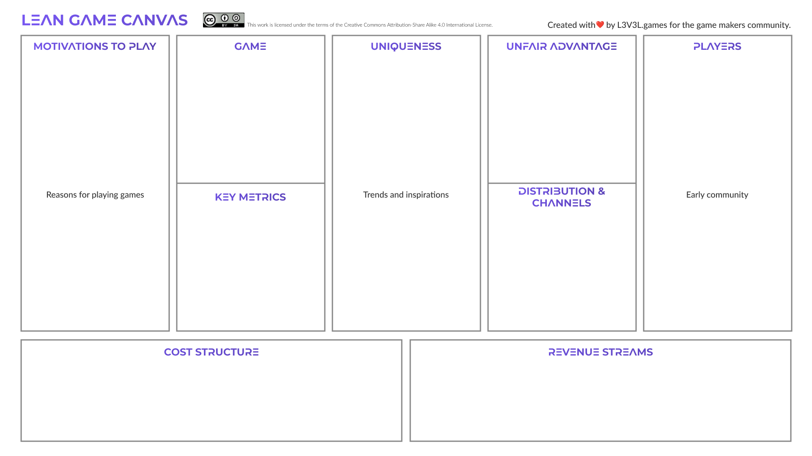
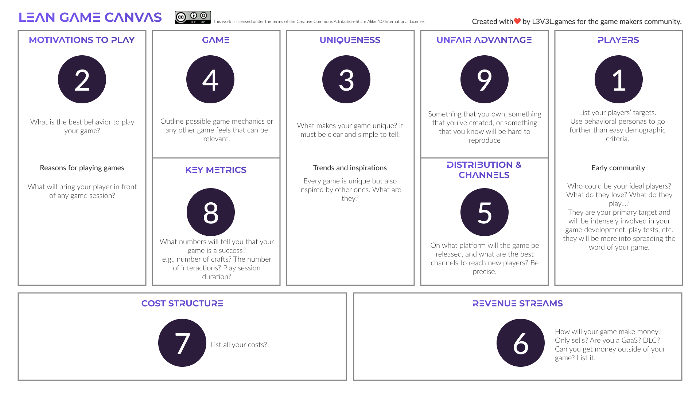

We built up a canvas inspired by the [Lean Canvas](https://leanstack.com/lean-canvas) of [Ash Maurya](https://twitter.com/ashmaurya), which is a derivative of the [Business Model Canvas](https://www.strategyzer.com/training/courses/mastering-business-testing) of [Alexander Osterwalder](https://twitter.com/AlexOsterwalder). We built it because you cannot make entertainment like any other business, but it still has to be a business.
We should also put game makers closer to the market, as Ash and Alexander say in other businesses.

We decided to make it under Creative Commons license so that you can use it for free, share it, and improve the way you're making games.
This work is licensed under the terms of the [Creative Commons Attribution-Share Alike 4.0 International License](https://creativecommons.org/licenses/by-sa/4.0/).

Download the JPG template by [clicking here](Lean game canvas.jpg)

Download the PDF template by [clicking here](Lean game canvas.pdf)

# What is the Lean Game Canvas?

It is a 9-panel canvas that will help you put all the elements of your game's thinking on paper to make it a successful project.
Like all other canvases of this kind, it is not magic, but it will help you to ask the right questions, see the strengths and weaknesses of your project, and work on the right things.

# How to use the Lean Game Canvas?

Inspired by Ash Maurya's Lean Canvas, the Lean Game Canvas should be completed in a set order, especially if this is your first time using this canvas. However, with practice and mastery of these nine mysterious boxes, you can adapt their use to your needs. Here are the different steps:

Download the JPG instructions by [clicking here](Lean game canvas instructions.jpg)

Download the PDF insctructions by [clicking here](Lean game canvas instructions.pdf)

1. Define your general target with personas and the precise share of players in your target who will be most interested in your game.

2. Define what will motivate players to play your game through their habits, behaviors, and expectations of a game.

3. Define the 3rd central pillar of the canvas: the originality of your game. What makes your game unique and attractive to players? Again, you must be able to write it in a simple sentence.

4. Then define your game and its primary mechanisms. You can also specify the game's overall feel through the graphics and the universe.

5. Then define the platform that will host your game and the channels you have to reach these players and inform them about your game.

6. Define your sources of income linked to the games and any other sources you may have.

7. Clearly state the expenses involved in developing your game. Be careful not to forget anything and not to underestimate anything.

8. Identify the metrics you will monitor to determine if your game is successful. Find engaging and precise metrics for your game.

9. Finally, identify, if you have them, the advantages you have that will make your game challenging to reproduce. Think here of your skills, your knowledge, and something complex and unique you have created.

The Lean Game Canvas is, first and foremost, a working tool. Therefore, it is essential to use it as such, make several drafts, and start again at different stages of your game development, focusing on specific aspects of the canvas or game.

You don't have to fill in all the boxes on the canvas to benefit from its effectiveness in structuring your thinking. It can be used at any stage of the development of a game, from the idea to its final version, to create new versions, new content, etc.

# Who should use the Lean Game Canvas?

It concerns all video game creators who want to put their game's thoughts on paper to obtain a structured synthesis.
Whether you're an independent designer, a producer in a 100-person studio, a marketing manager for a new studio, or anyone else who wonders if there's a way to make choices and test a concept or game idea to make it more successful, the Lean Game Canvas will help you!
In addition, you can use the Lean Game Canvas in many ways. For example, it can help you define your game's overall concept in the ideation phase, or it can help you test an evolution of your game that has been running for several months. Then, it will require you to fill in the nine boxes with other information.

# Why the Lean Game Canvas?
Because, as indie game makers, we faced so many situations when we did not know how to move or change a game, what are the best options? We then started a journey and met many other game makers. They all told us that creating a game is a mysterious part of the job. Most of the answers were, "You just have to be good." Unfortunately, that answer wasn't enough, and we decided to port an existing tool to the game industry.

We think that the Lean Canvas of Ash Maurya is an amazing one! We loved the way it worked on other businesses. We loved the method explained over many pages in the book ["The Lean Startup"](https://www.amazon.fr/Lean-Startup-Entrepreneurs-Continuous-Innovation/dp/0307887898) by [Eric Ries](https://twitter.com/ericries). But when it comes to entertainment, nothing stands up as you're not solving any problem. Or at least we are all solving the same problem: boredom. As Netflix's founder Reed Hastings said, ["We compete with everything you do to relax. We compete with video gaming, we compete with drinking a bottle of wine. That's a particularly tough one."](https://youtu.be/BsXXIfqbnRk?t=1310). It's perfectly accurate in our highly competitive market of games. So, when building a game company, the question is "What will make the player choose to play rather than drink a glass of wine with friends and family or watch Netflix?" (cheers to Reed and Netflix Games) rather than "Will he choose my game?" which is only the second question.

# Who created the Lean Game Canvas?
We are not serial entrepreneurs, neither researchers nor influencers. We are indies that want to push something that may help others who want to create the best fun and entertaining experiences. We should change how we build video games to make them more profitable. Making games is the most profound thing in the world because fun helps us learn new things, meet new people, dive deep into complex issues, and make life better!
